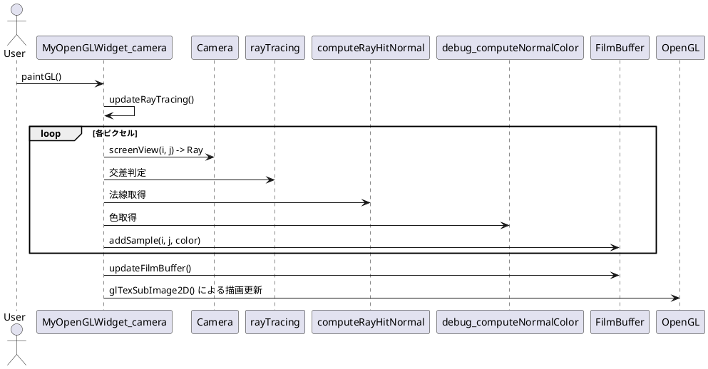
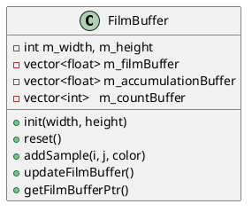

# 🌟 プログレッシブ・レンダリング仕様メモ

## 📌 概要

本プロジェクトでは、レイトレーシングによる可視化に対して「**プログレッシブ・レンダリング**」を導入しました。
これは、各ピクセルに対して複数回のサンプルを蓄積することにより、時間と共に画質を向上させる手法です。

---

## ✅ 現在の対応内容

- ✅ `FilmBuffer::addSample()` によるピクセルごとの色蓄積処理の導入
- ✅ `FilmBuffer::updateFilmBuffer()` による平均色の更新処理の導入
- ✅ `std::vector` による蓄積バッファ（`m_accumulationBuffer`）とカウントバッファ（`m_countBuffer`）の導入
- ✅ `getFilmBufferPtr()` を用いた `OpenGL` へのバッファ転送対応

---

## 📂 関連ファイル

- `film_buffer.h / .cpp`: プログレッシブ蓄積処理の本体クラス
- `myopenglwidget_camera.cpp`: `updateRayTracing()` によって `addSample()` を呼び出し、`updateFilmBuffer()` で色を平均化して描画

---

## 🧠 動作の流れ

---

## 🧱 クラス構成（簡易）

---

## 🔄 更新すべき関数（ステップ案）

| ステップ | 関数名                    | 内容                                               |
|--------|-------------------------|--------------------------------------------------|
| 1      | `addSample()`           | ピクセルごとに色を加算（合計）                    |
| 2      | `updateFilmBuffer()`    | サンプル数で割って平均色に変換                     |
| 3      | `getFilmBufferPtr()`    | OpenGL描画用にバッファを取得                        |
| 4      | `reset()`               | 描画開始時にバッファ初期化（任意）                 |

---

## 🔍 備考

- 各ピクセルのサンプル数が異なるため、`countBuffer` により平均計算を適切に行う。
- `float` による色バッファの扱いにより、任意精度のサンプリングが可能。
- サンプル数を変数で制御すれば、将来的に「適応的サンプリング」にも応用可能。